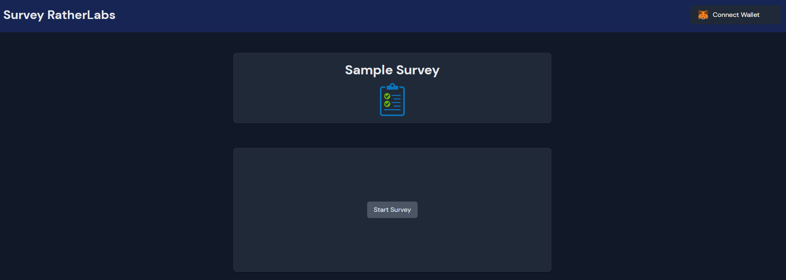

# Survey RatherLabs Challenge

A Web3 survey connected to the Goerli network that rewards users with QUIZ tokens upon completion of the process.

## Requirements

To run this project, you'll need:

- Node.js version 16 or higher installed on your computer.
- Yarn or npm package manager installed on your computer.
- Metamask wallet extension installed on your browser. You can download and install it from [metamask.io](https://metamask.io/).
- Have Goerli network connected on your metamask and have Ethers for Gas Transactions. [Faucet One](https://goerlifaucet.com/).

## Tools Used

List of tools, frameworks, libraries, or APIs used in the project. You can also include any development environment or text editor used.

- [ESLint](https://eslint.org/) - A pluggable and configurable linter tool for identifying and reporting on patterns in JavaScript code.
- [Prettier](https://prettier.io/) - An opinionated code formatter that enforces consistent code styles across your entire codebase.
- [TypeScript](https://www.typescriptlang.org/) - A superset of JavaScript that provides static typing and other language features.
- [Husky](https://typicode.github.io/husky/) - A tool that provides Git hooks for running scripts before committing or pushing code changes.
- [MobX-state-tree](https://mobx-state-tree.js.org/) - A library for creating immutable state trees with first-className support for TypeScript.
- [Tailwind CSS](https://tailwindcss.com/) - A utility-first CSS framework for quickly building custom designs without writing CSS from scratch.
- [Ethers](https://docs.ethers.io/v5/) - A library for interacting with the Ethereum blockchain and its ecosystem.

## Getting Started

To get started with this project, follow these steps:

1. Install Node.js 16 or higher on your computer. You can download it from [nodejs.org](https://nodejs.org/).
2. Install the project dependencies using either Yarn or npm. To install with Yarn, run `yarn install`. To install with npm, run `npm install`.
3. Start the development server by running `yarn dev` or `npm run dev` in the terminal.
4. Open your browser and navigate to `http://localhost:3000` to view the application.
5. Navigate to the deployed site at [vercel](https://survey-indol.vercel.app/) to view the live application.

## Tasks

List of tasks that need to be completed for the project, such as fixing bugs, implementing new features, or refactoring code. You can also use this section to assign tasks to specific team members or contributors.

- [x] Connect Metamask wallet.
- [x] Ensure the user is connected to the Goerli network. If not, show a button to switch networks automatically.
- [x] Display the balance of the $QUIZ token ([address](https://goerli.etherscan.io/address/0x437ef217203452317c3c955cf282b1ee5f6aaf72)).
- [x] Present the title of the daily trivia with its picture and a button to begin answering once the page is loaded.
- [x] Display the current question once the survey starts, and make it available for the amount of time specified in the `lifetimeSeconds` property.
- [x] Move onto the next question whether it's answered or not.
- [x] Show an overview with all the answers once all the questions are finished.
- [x] Show a button to submit the questions to the validator contract.
- [x] Refresh the balance of $QUIZ.

## Bonus Tasks

List of tasks as Bonus, as clean code, scalable solution, etc

- [x] Implement MobX as global statment
- [x] Animations
- [x] Code Documentation
- [x] Reset the values after submit
- [x] Loading to wait the tx finish
- [x] Deployed on Vercel
- [x] Add a Progress Bar to show the expected size of answers
- [x] Update the account when is changed on Metamask
- [x] Save the wallet localStorage in case the user close or refresh the page
- [ ] Save the answers localStorage in case the user close or refresh the page
- [ ] Replace the alert to show notifications
